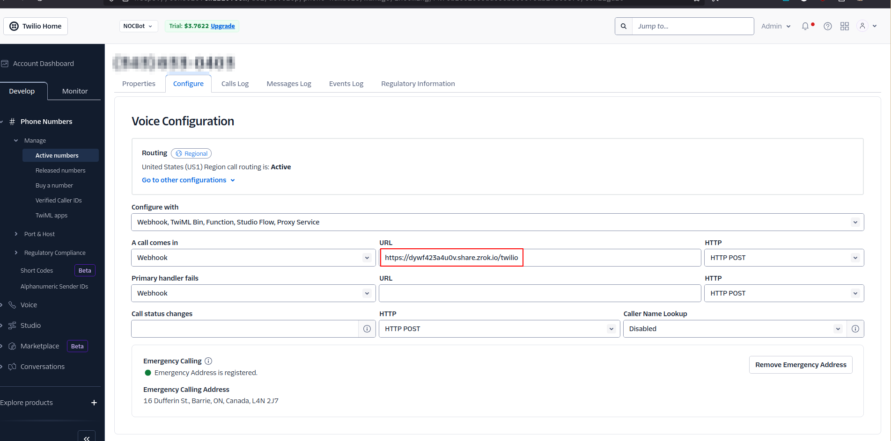
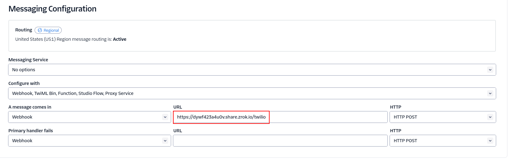
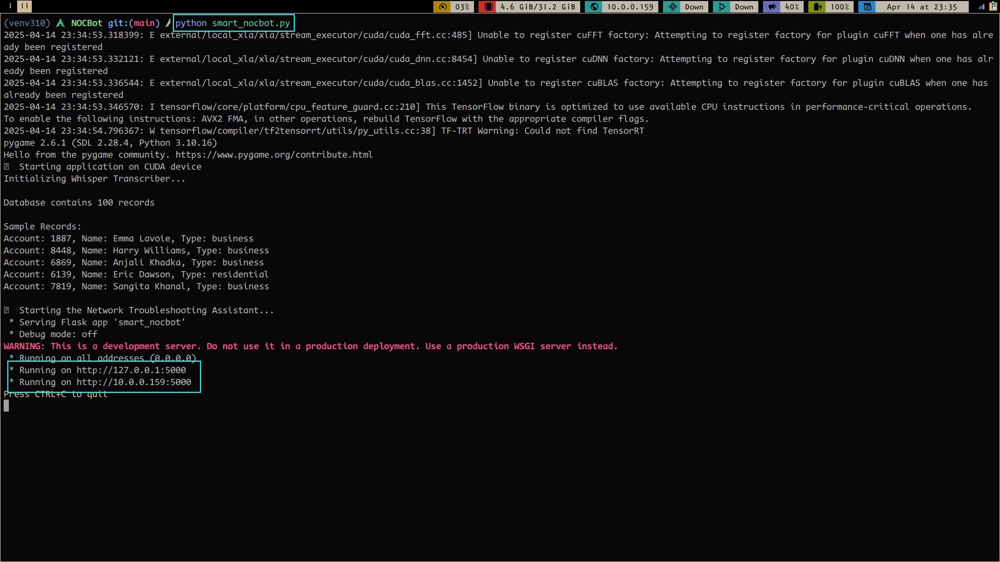

## NOCBot: AI-Powered Voice Assistant for ISP Customer Support
NOCBot is an innovative project designed to revolutionize after-hours customer support for Internet Service Providers (ISPs). By leveraging AI automation, NOCBot aims to replace costly third-party call centers with an intelligent voice assistant, providing immediate and effective support to customers regardless of the time of day or their service level. This initiative seeks to enhance customer experience, particularly in rural areas, while significantly reducing operational overhead for ISPs.

### Note before trying to run the program:
You must have to create accounts for the services used.
1. **Twilio Account**
- Here is the guide for creating a trail account: https://www.twilio.com/docs/messaging/guides/how-to-use-your-free-trial-account

2. **Zrok Account**
- Since our flask application is internally hosted, Zrok is required to expose the internal flask application to public endpoint creating a HTTPs tunnel so that twilio can connect to it. Twilio requires public endpoint to route the call. Here are the steps:
    - Create and set up a Zrok account using this guide: https://docs.zrok.io/docs/getting-started/
    - Once done, copy the URL and paste it into Twilio's configuration page on both Calls and Messages. The image is shown below:
    
    
    - Now, you should be able to run the program by calling the number that you got in Twilio. 

3. **ConnectWise API (Optional)**
- Since we have used ConnectWise PSA as our ticketing system, you would require to create ConnectWise Account. Then you would require an API Key for your account that you can use to implement the ConnectWise middleware that we built. Please check .env file in the project for detailed information in what specific items you would require.

- For the demo during class presentation, we were successfully able to show case this. Unfortunately, I cannot share that API key because it belongs to the company I work for and it is of a production environment. 

- This is only required if we want to create a ticket in clients ticketing system. This is put as optional for now because the ticketing system in clients end might vary and we might have to build another middleware specific to that ticketing system. For example, if some ISP are using PowerCode as their ticketing system, then we need to build a middleware from scratch that works with our NOCBot and PowerCode.

### Program requirements:
1. Python 3.10
2. SQLite DB

### Another Note:
For the simplicity sake, we compiled all of our modules to one single python file, so you can simply run one single file and it should be fine. However, it is recommended in future to break down each module into different directories for modularity & readability.

### Database Setup
We have a test database pushed into the GitHub called ***“customers_db.sqlite”*** so you can utilize it. We used a python script ***“users_generator.py”*** to generate test users database. However, you can simply use the one that comes with it.

### Steps to run the program:
1. Clone the website.
    - git clone https://github.com/entertainmyfaith/NOCBot.git
    - cd NOCBot

2. Create a python virtual environment on your PC:
    - python -m venv my_venv

3. Install the libraries and dependencies:
    - pip install -r requirements.txt

4. Update the .env file with your own API keys

5. Make sure the database file is present. It is the one with the name “customers_db.sqlite” along site the models and intents.

6. Run the python program:
    - python smart_nocbot.py

If the environment was setup correct, all the services account were created and activated, API keys were properly put into right place and all the libraries were installed correctly, the program should run and look something like this:

Once the program is running, you can call the Twilio number from your verified number in Twilio and our NOCBot should answer your call.

For any sort of assistance, please email at: kcsrijal@protonmail.com
